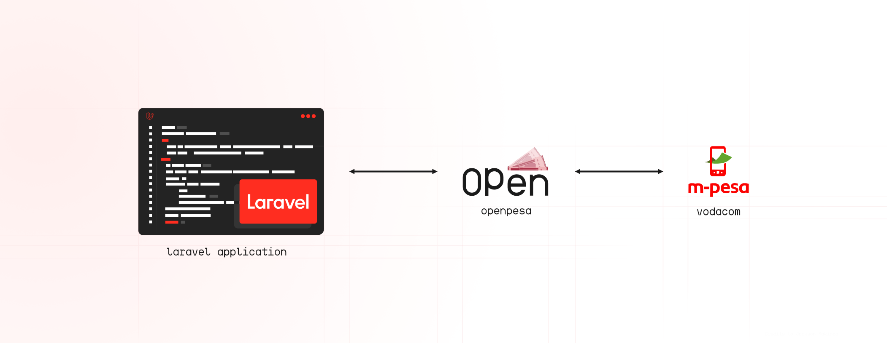

<h1 align="center">Laravel pesa</h1>

<p align="center">
    <a href="https://packagist.org/packages/openpesa/laravel-pesa">
        
    </a>
    <a href="https://packagist.org/packages/openpesa/laravel-pesa">
        
    </a>
</p>

<p align="center">
 <picture>
      <source media="(prefers-color-scheme: dark)" srcset="./img/banner/header-dark.png">
      
    </picture>
 <p align="center">Offers effortless integration with mobile money operators, such as Vodacom's M-Pesa, for seamless inclusion in your Laravel applications. 💰</p>
</p>

<p align="center">
    <a href="https://github.com/alphaolomi/laravel-pesa-demo">View Demo</a>
    ·
    <a href="https://github.com/openpesa/laravel-pesa/issues/new/choose">Report Bug</a>
    ·
    <a href="https://github.com/openpesa/laravel-pesa/issues/new/choose">Request Feature</a>
</p>

## Documentation

🚧 **Work in Progress**

For detailed instructions on package usage, please refer to the example readme available [here](https://github.com/alphaolomi/laravel-pesa-demo).

## 🚀 Installation

You can install the package via Composer:

```bash

composer require openpesa/laravel-pesa

```

## 💼 Usage

### Using Facades

```php

use Openpesa\Pesa\Facades\Pesa;

// This route will be mapped to: `your-URL/api/charge`
Route::get('/charge', function () {
    $response = Pesa::c2b([
        'input_Amount' => 5000, // Amount to be charged
        'input_Country' => 'TZN',
        'input_Currency' => 'TZS',
        'input_CustomerMSISDN' => '000000000001', // Replace with your phone number
        'input_ServiceProviderCode' => '000001', // Replace with your service provider code given by M-Pesa
        'input_ThirdPartyConversationID' => 'mpesatz', // Unique
        'input_TransactionReference' => 'imethibitishwa', // Unique
        'input_PurchasedItemsDesc' => 'Item description'
    });

    return $response;
});

```

## 💼 Usage

```bash

composer test

```

## 📜 Changelog

Please see [CHANGELOG](CHANGELOG.md) for more information on what has changed recently.

## 🤝 Contributing

Please see [CONTRIBUTING](.github/CONTRIBUTING.md) for details.

## 🔐 Security Vulnerabilities

Please review [our security policy](../../security/policy) on how to report security vulnerabilities.

## 👥 Credits

-   [All Contributors](../../contributors)

## 📄 License

The MIT License (MIT). Please see [License File](LICENSE.md) for more information.
